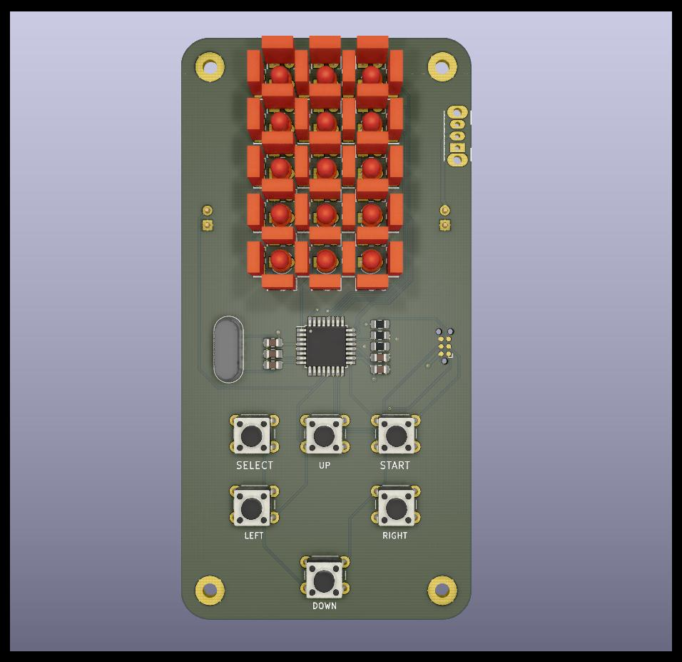
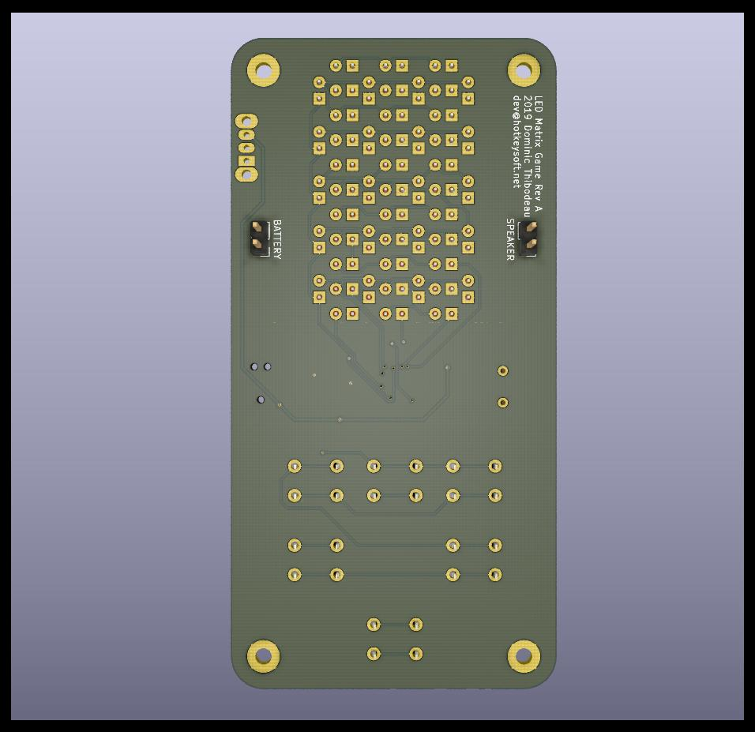
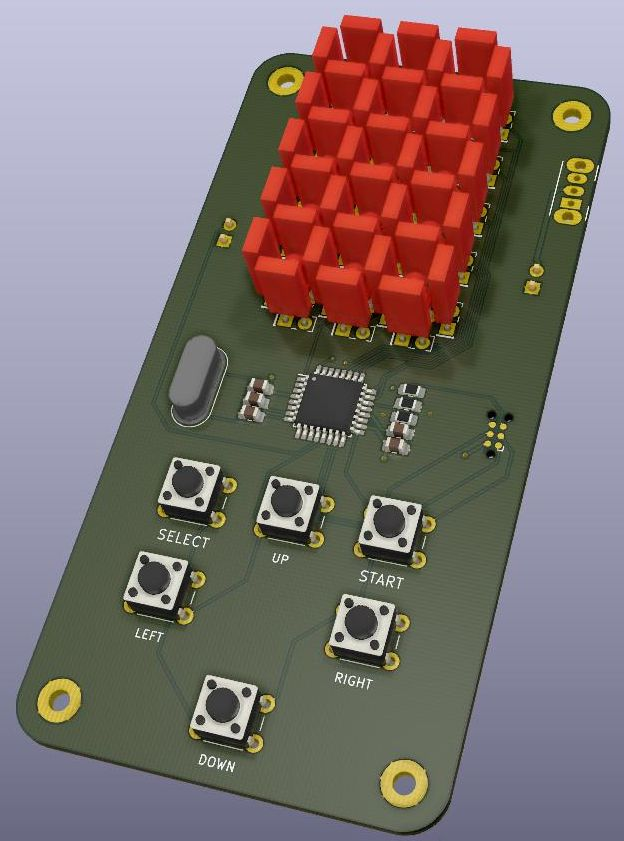

# LED Matrix Game
Rev A October 2019

### Handheld Electronic Game
- ATmega328PB microcontroller running at 12MHz
- 53 LEDs
- 6 push buttons
- Buzzer
- Tag-Connect for programming
- Runs on 3 AAA batteries

The microcontroller runs a [TMS1000-series emulator](https://github.com/hotkeysoft/emulators) I made.

The Split Second game (by *Parker Brothers*) TMS1400 ROM is loaded on the emulator.

Images
============
|Front                                                 | Back                                              |
|------------------------------------------------------|---------------------------------------------------|
|||

### Schematics (pdf)
- [Complete schematics](./img/schema.pdf)

### PCB Images (svg)
- [Top](./img/pcb-front.svg)
- [Bottom](./img/pcb-back.svg)
